# E-commerce Data Analysis

This repository analyzes the [Retail II UCI dataset](https://archive.ics.uci.edu/ml/datasets/Online+Retail+II) to uncover customer behavior, product performance, and sales trends using PostgreSQL (via DBeaver) for data processing and Jupyter Notebook with Plotly for visualizations.

## Project Overview

The dataset ([Retail II UCI dataset](https://archive.ics.uci.edu/ml/datasets/Online+Retail+II)) includes transactional data with columns for invoice details, product information, customer IDs, and more. The analysis includes:

- **Data Cleaning**: Handling data types (e.g., converting `CustomerID` from float to integer) and checking for null values or negative quantities.
- **RFM Analysis**: Segmenting customers into categories like Champions, Loyal, Potential Loyalist, New Customers, At Risk, and Dormant based on Recency, Frequency, and Monetary metrics.
- **Retention Analysis**: Measuring customer retention rates, including the percentage of customers returning for a second purchase within 90 days with average order value (AOV) for each case.
- **Cohort Analysis**: Analyzing customer retention rates segmented by acquisition month (first purchase month) and calculating the average monthly new customer acquisition volume over one year.
- **Key Statistics**: Identifying top 10 customers and their associated total spending, and ranking top 10 products by quantity and sales.
- **Sales Trends**: Calculating monthly, quarterly, and day-of-week sales. 
- **Seasonal Analysis**: Identifying the top five products based on their consistent appearance in monthly and quarterly best-selling lists, and analyzing performance during specific seasons (Christmas, Black Friday).
- **Visualizations**: Generating interactive bar charts, line charts, and heat maps using Plotly to illustrate key findings from all analytical sections above. Creating two dashboards with Tableau Public: one for a key statistics overview and one for RFM/Cohort analysis.

## Project Deliverables
The full interactive dashboard detailing all key insights and visualizations can be explored live on [Tableau Public](https://public.tableau.com/app/profile/mo.koul/viz/ECommerceSalesRFMCohort/ECommerceOverview?publish=yes).

[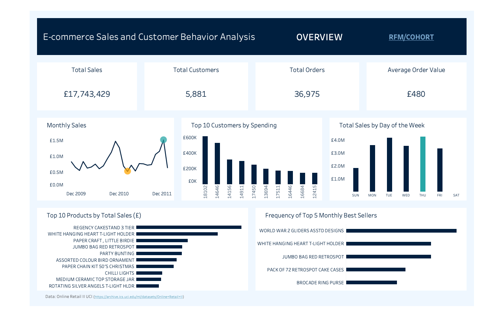](https://public.tableau.com/app/profile/mo.koul/viz/ECommerceSalesRFMCohort/ECommerceOverview?publish=yes)

## Key Business Insights

### 1. Customer Segment Profiles

We utilized an RFM (Recency, Frequency, Monetary value) analysis based on full two-year dataset, to identify six distinct customer segments. The table below outlines the behavioral profile of each group based on their average spending habits, visit frequency, and days since their last visit (Avg. Recency):

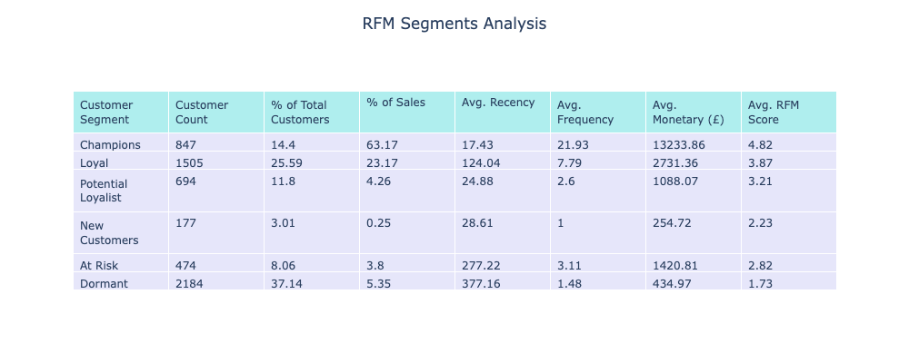
### 2. Who are the most valuable customers?

 Most valuable customers are defined within the **'Champion'** segment. 
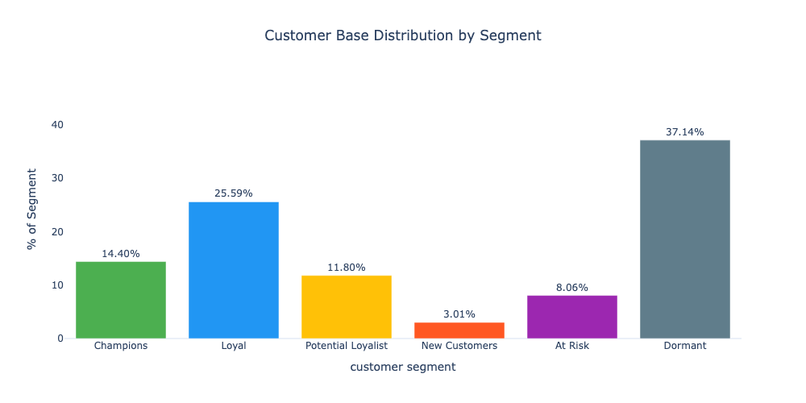
*   This elite group makes up approximately **14%** of  total customer base but is responsible for generating a substantial **63% of total sales** over the period of two years of data.
*   Champions exhibit significantly higher engagement (2.8x more frequent buys) and monetary value (4.8x higher spend) compared to the next tier, **'Loyal Customers'**.

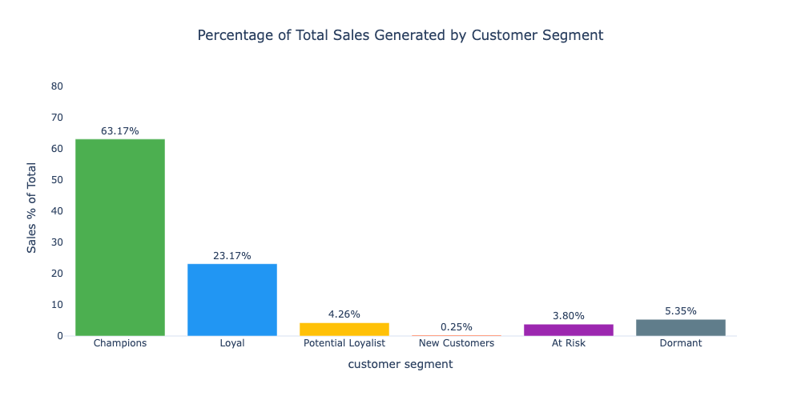

#### Lifetime Value Comparison (2011 Snapshot)

We estimated forward-looking Customer Lifetime Value using only 2011 spending behaviour combined with the actual observed 2010→2011 retention rate. This leverages the standard simplified formula:

$$
\text{CLV} = \text{AOV} \times \text{Frequency} \times \frac{1}{(1 – \text{Retention Rate})}
$$

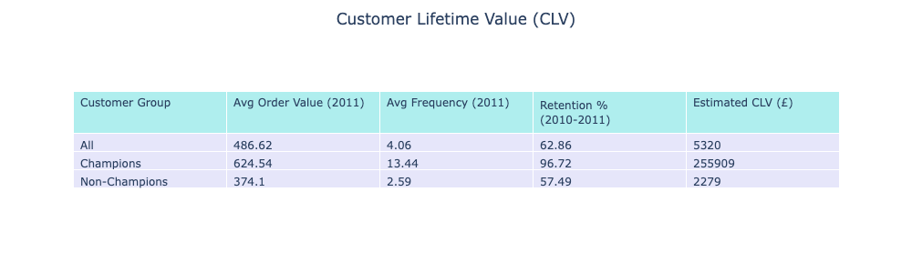
**Key Insight**  
The absolute £256k lifetime value for Champions comes from a simplified model (constant behaviour forever, no discounting). In reality, no customer buys forever, so the true pound amount will be lower.  

What is not an exaggeration and remains extremely robust is the **relative difference**:

- A Champion generates **~48× more gross sales** over their lifetime than the average customer  
- A Champion generates **~110× more gross sales** than a Non-Champion

This massive gap is driven almost entirely by Champion's exceptional 96.72% annual retention rate (just 3.28% annual churn). Even when we apply realistic time horizons (5–10 years) and standard discount rates, Champions are still worth many tens of thousands of pounds more than customers in any other segment.
The data is clear: resources spent on keeping Champions (personalised service, exclusive perks, proactive outreach, etc.) have by far the highest ROI of any customer-related initiative.

**Top Spenders:** The top 10 customers generated £2.8M in sales, representing a 15.93% share of the overall £17.7M total sales for the period.
    * Notably, CustomerID 18102 spent over £608K during the analyzed period.
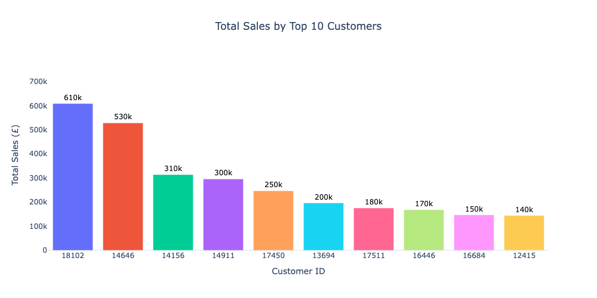

#### Strategy for Champion Customers:

Given their disproportionate impact on sales, the strategy should be focused on maximizing their retention and total sales generated from this group :

*   **Prioritize Loyalty Perks:** Implement exclusive loyalty programs, early access to new products, and personalized offers.
*   **Maximize Retention:** The focus should be on building deep brand connection with high-value customers and using existing loyalty to encourage higher-value actions such as purchasing premium products and exploring add-ons.

### 3. Which customers are at risk of churning?

Out of 5881 customers, We identified **474** as being **'At Risk'** of churning (approximately 8% of the customer base).

*   **Average Recency:** These customers have an average recency of **277 days** since their last purchase.
*   **Sales Contribution:** They still contribute nearly **3.8% of total sales**, making them a priority for win-back campaigns.
*   **Interpretation:** An average purchase gap of over nine months suggests these customers are highly likely to churn soon. Immediate intervention (e.g., targeted incentives) is required to recover this valuable customer segment.

### 4. Repeat Purchase Behavior

Over the two-year period **72%** of the customer base made at least one repeat purchase, and these repeat buyers generated **96.8%** of total sales.

### 5. What percentage of customers return within the first 90 days

46% of new customers return within the first 90 days. This group of repeat buyers is highly valuable, generating 80% of total sales (£14M). While the average first-purchase value is £415, Second purchase value is slightly lower (£367 vs £415).

### 6. How many new customers are we acquiring?

We analyzed new customer acquisition month-over-month to identify trends in business growth.
* **Acquisition Trend:** The business experienced a sharp decline in monthly new customer acquisition rates in 2011 compared to 2010.
  * In 2010, acquisition averaged roughly 282 new customers per month.
  * In 2011, this average dropped to approximately 128 new customers per month.
* **Peak Acquisition:** The highest acquisition occurred in March 2010 (443 new customers), while December and January saw the lowest rates (76 in Dec 2010, 71 in Jan 2011) across two years.
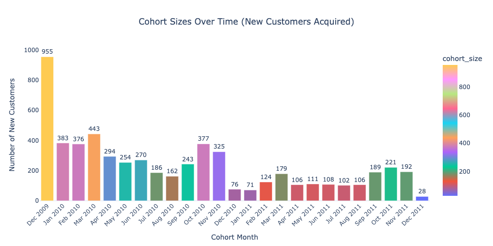
### 7. How effectively are we retaining customers over time?

To understand customer loyalty and identify churn patterns, a detailed cohort analysis tracking customer retention rates month-over-month was performed.
Key Metrics and Trends:

* **High Initial Churn (Month 1):** The average Month 1 retention rate across all cohorts is 21.2%. This sharp drop after the first purchase indicates significant early-stage churn.
Recommendation: Implement targeted onboarding email campaigns or a first-time repeat purchase discount within the first 30 days to encourage a second transaction.
* **Seasonal Volatility in Early Retention:** Month 1 retention varied significantly across cohorts. The highest was October 2011 (32.13%), while the lowest was December 2010 (9.2%), highlighting the impact of seasonality on early customer behavior.
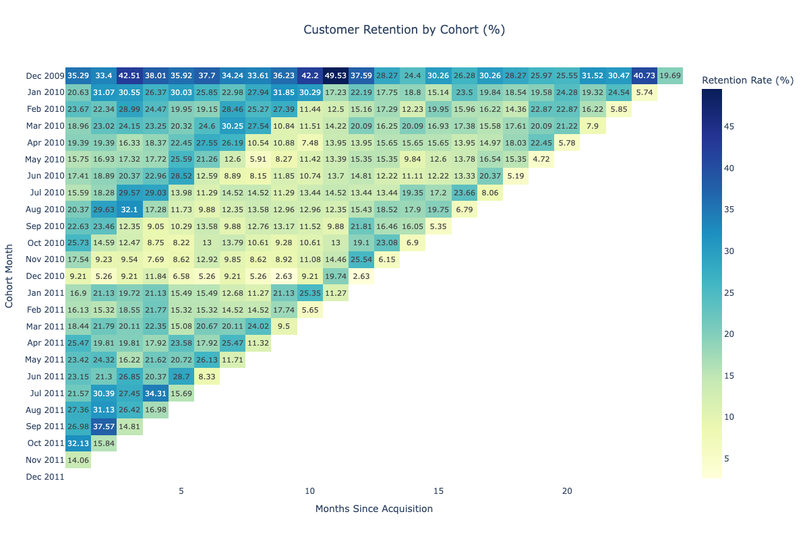

*  **Long-Term Loyalty Trends:**
The retention rate dips below the Month 1 baseline starting from Month 4, and this lower rate persists through Month 22.
The lowest average retention point across all observed periods is Month 10 (~15%), while retention briefly peaks again at Month 23 (23.23%).
*  **Overall Observation:** Customer retention rates generally remained below 20% after the first month. The year 2011 experienced consistently lower retention rates compared to the cohorts acquired in 2010.
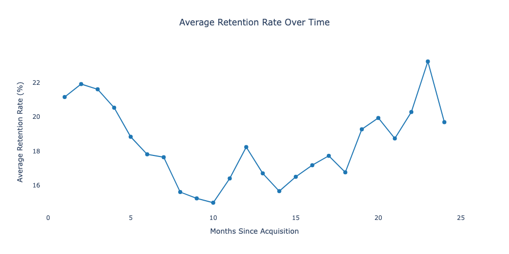

### 8. What are the overall sales trends over time (monthly/quarterly)

We analyzed the sales data spanning December 2009 to December 2011 to identify key temporal trends and seasonality:
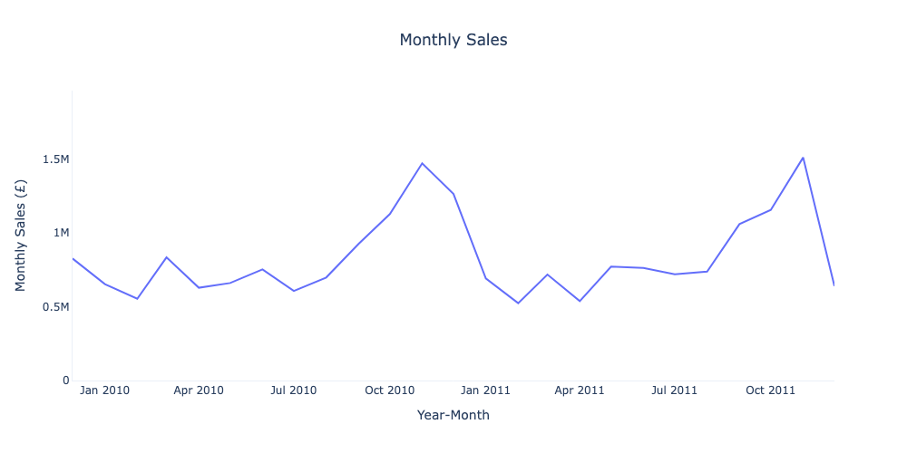

*   **Sales Stability & Seasonality:** Average monthly sales remained relatively stable throughout the year, with significant peaks consistently observed during the Q4 holiday shopping periods (November).
*   **Peak Performance:** November 2011 recorded the highest single month's sales (£1.5M), while Q4 2010 was the overall strongest quarter (£3.8M).
*   **Interpretation:** The consistent Q4 peaks suggest strong seasonality driven by holiday shopping behavior.
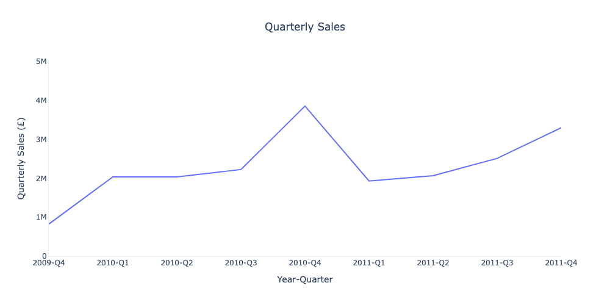
*   **Day-of-Week Trends:** Accumulated sales data across both years shows a peak in sales activity on **Thursdays**, followed by Tuesdays. Sundays show the lowest sales volume. This insight can optimize staffing schedules and marketing campaign timing.
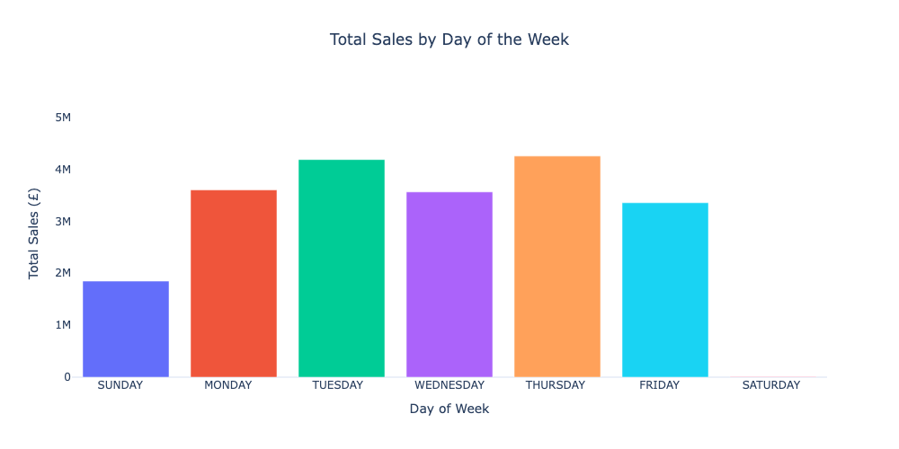
### 9. Product Performance
We analyzed product performance based on both sales volume and total sales to distinguish between high-demand, low-cost items and premium, high-value products. This insight is crucial for optimizing inventory management, pricing strategies, and marketing efforts.
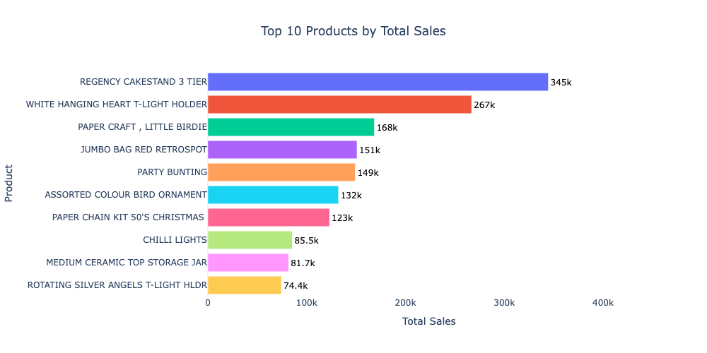

**Key Observations:**. 

*  **Top Physical Product:** The **REGENCY CAKESTAND 3 TIER** is the clear leader in physical product sales, generating over **£345K** in sales.
*  **Broad Interest:**  Products such as "WORLD WAR 2 GLIDERS ASSTD DESIGNS" (top quantity) and "WHITE HANGING HEART T-LIGHT HOLDER" have generated huge sales, showing strong demand for lower-priced novelty or decor items.
*  **Exceptional Performer:** The "WHITE HANGING HEART T-LIGHT HOLDER" is a uniquely valuable item that dominates both sales volume and sales charts. Appearing in both top 10 lists, it generated approximately £267K in sales — significantly more than the next highest product (£168K)—indicating exceptional demand and profitability.
*  **Diverse Portfolio:** The top-selling items suggest a diverse portfolio including home decor, craft items, and seasonal goods, indicating a broad customer interest.
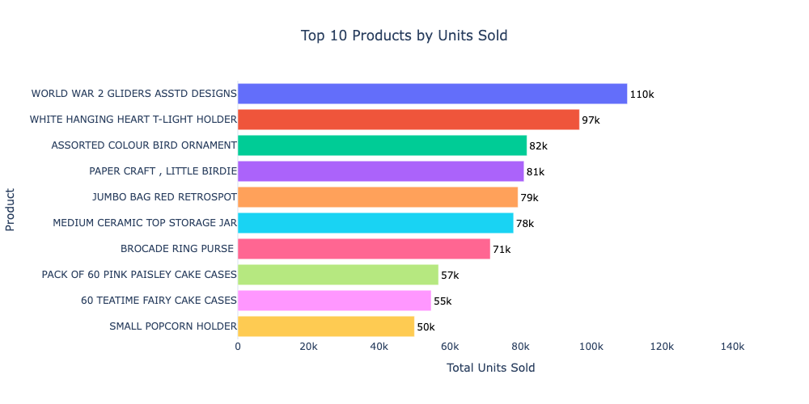
### 10. Inventory & Warehousing Strategy (Quantity Sold Analysis)
To optimize warehouse efficiency and ensure product availability, we analyzed product popularity based on total units sold, focusing on consistent top performers rather than just sales spikes.
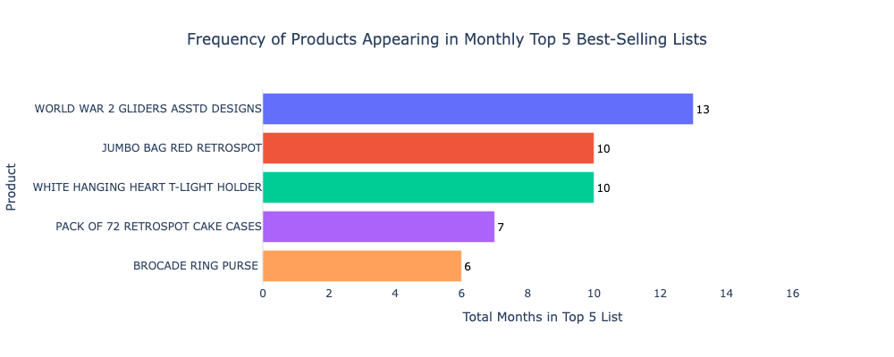
* **Consistently Popular Products (Frequency Analysis)**  
  * **Inventory Champion:** The **"WORLD WAR 2 GLIDERS ASSTD DESIGNS"**  is the most consistent volume seller, appearing in the top 5 list across 13 different months and 6 different quarters. This product requires continuous stocking and optimized warehouse space.

  *  **Reliable Volume:** The  **"WHITE HANGING HEART T-LIGHT HOLDER"** is a close second in monthly and quarterly frequency counts, indicating a steady, high turnover rate.

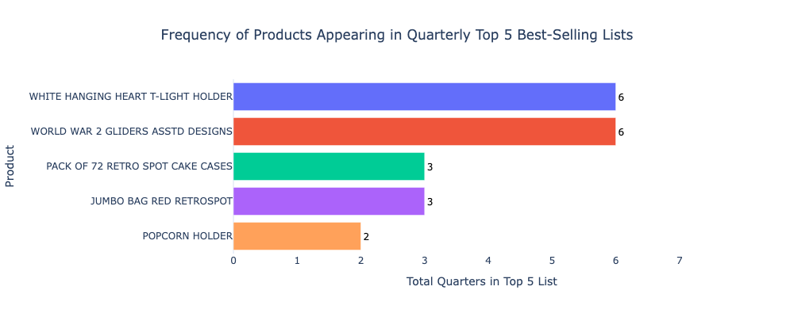

*  **Business Insight for Logistics:**  
    *   **Prioritize Stocking:** The top two frequent items should be positioned for easy picking in the warehouse due to their high velocity.
    *   **Demand Planning:** These frequency counts provide a strong baseline for demand forecasting, ensuring minimal stock-outs for core, consistently popular items.
    *  **Cross-Reference:** These findings complement the sales analysis (Section 5) by confirming that high sales for these specific items is driven by high volume, not just high price points.

## Repository Structure

- **notebooks/**: Jupyter notebook containing Python code (using Plotly) used to generate the final visualizations from the processed data.
- **sql_queries/**: Contains PostgreSQL queries:
  - `01_data_setup.sql` Table creation and data cleaning
  - `02_RFM_analysis.sql` RFM analysis
  - `03_customer_retention.sql` Customer retention analysis
  - `04_cohort_analysis.sql` Cohort analysis
  - `05_key_statistics.sql` Top customers and products, product affinity
  - `06_sales_trends.sql` Sales statistics (monthly, quarterly, day-of-week)
  - `07_seasonal_analysis.sql` Seasonal popularity, Christmas and Black Friday sales
  - `08_cohort_analysis_champions.sql` Cohort Analysis for champions
  - `09_CLV_metrics.sql` Calculates  AOV, average frequency, retention rate and estimated CLV for all customers, Champions and Non-Champions in 2011
  - `all_queries.sql` All queries in one file
 
- **visualizations/**: Contains output image and HTML files generated by the Jupyter notebook
- **data/**: Sample CSV files (e.g., `customer_segment.csv`, `top10_customers.csv`, etc.) generated by the SQL queries and used as input for the notebook.  
- **workbooks/**: Tableau packaged workbooks (.twbx) for the project's data visualizations.

## Softwares and Libraries

The following software and libraries were used in this project:

- **PostgreSQL**: Used for executing all SQL queries and data processing. [PostgreSQL Documentation](https://www.postgresql.org/docs/)
- **DBeaver** (optional): Used for executing SQL queries and exporting results. [DBeaver Documentation](https://dbeaver.io/docs/)
- **Jupyter Notebook**: Utilized for creating visualizations and documenting the analysis process. [Jupyter Notebook Documentation](https://jupyter-notebook.readthedocs.io/en/stable/)
- **Python Libraries**:
  - **pandas**: Employed for data manipulation and analysis within the notebooks. [pandas Documentation](https://pandas.pydata.org/docs/)
  - **plotly**: Used for generating interactive visualizations. [Plotly Python Documentation](https://plotly.com/python/)
- **Tableau**: Used for creating dashboards. [Tableau Public](https://public.tableau.com/app/discover)

## License
This project is licensed under the MIT License - see the [LICENSE](LICENSE) file for details.

 
